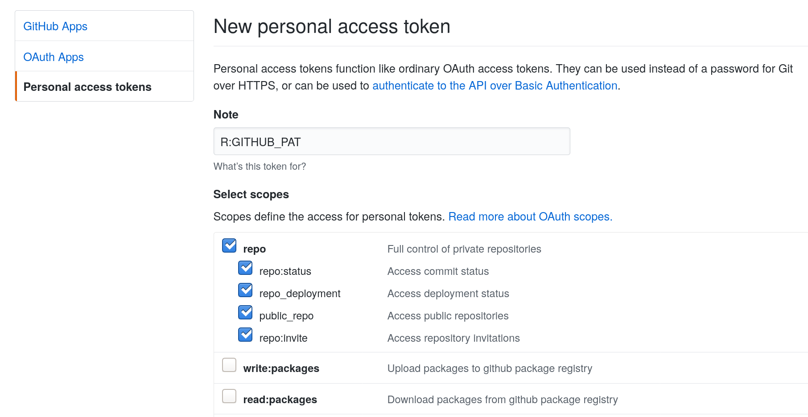
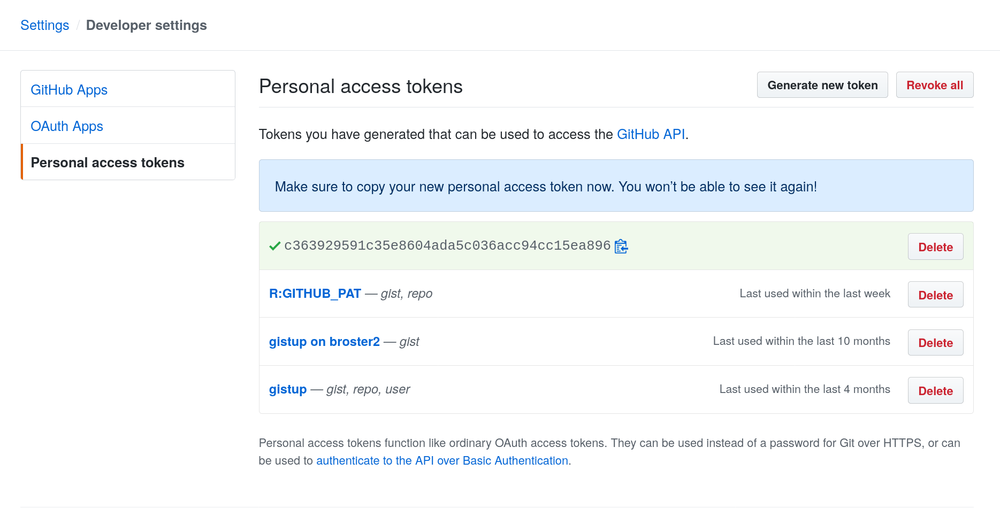
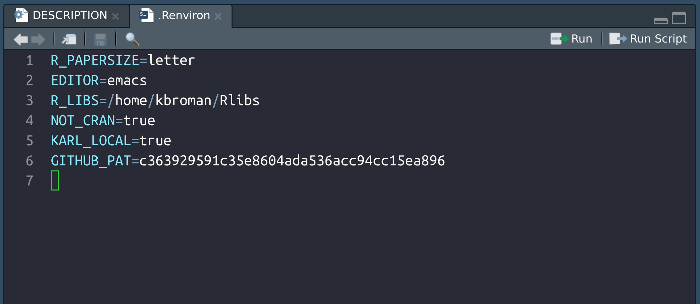

I will demonstrate the use of the
[usethis](https://usethis.r-lib.org/) and
[devtools](https://devtools.r-lib.org/) packages to create an R
package. I'll be doing this in [RStudio
desktop](https://rstudio.com/products/rstudio/download/#download).

### Start with some functions

I think it's best to start with some functions that we want to put
in the R package. We will use a pair of functions: one for simulating
Brownian motion, and the second for plotting the results.

```r
simBrM <-
function(n, sigma=1)
{
    stopifnot(n>=2, sigma>0)

    x <- matrix(rnorm(n*2, 0, sigma), ncol=2)
    colnames(x) <- c("x", "y")

    apply(x, 2, cumsum)
}

plot_simBrM <-
function(x, pointcolor=c("slateblue", "violetred"), ...)
{
    stopifnot(is.matrix(x), ncol(x)>=2, nrow(x)>=2)

    if(is.null(colnames(x))) colnames(x) <- c("x", "y")

    plot(x[,1], x[,2], xlab=colnames(x)[1], ylab=colnames(x)[2],
         type="l", las=1, ...)

    if(!is.null(pointcolor)) {
        points(x[c(1,nrow(x)), 1], x[c(1,nrow(x)), 2],
               pch=21, bg=pointcolor)
    }
}
```

Our goal is to make a package containing these functions.

### Create package skeleton

We first use `usethis::create_package()` to create a directory for
the package plus the skeleton of the files that are needed.
I'm going to place it on my Desktop (because I'm just going to
delete it later). But generally I keep my R packages in `~/Code/`.

```r
library(usethis)
create_package("~/Desktop/simBrM")
```

This will create a directory to contain the package, create some of
the basic files and subdirectories that are needed, including to
make the package directory an [RStudio
Project](https://r4ds.had.co.nz/workflow-projects.html), and then
open up another copy of RStudio with that project open.

### Make it a git repository

Next I'll make it a git repository.

```r
use_git()
```

It will ask me a couple of questions about making an initial
commit and will restart RStudio.

I'll next edit the `DESCRIPTION` file. I'll click on it in the
Files pane and will edit the `Title`, `Authors@R`, and
`Description` fields.

The title is supposed to be in "title case" (all words capitalized),
and the description is supposed to be one or more complete
sentences (start with capital letter and end with period).

I'll then click the Git pane in RStudio and stage and commit the
change.

### Put it on GitHub

I'll next connect to GitHub and will push my repository there.

```r
use_github()
```

If you've not connected to GitHub before, this will give an error,
and you need to set up a "personal token" in order to do things
like create github repositories from R. So you'll first do:

```r
browse_github_token()
```

This will open up a browser, ask you to log in to your github
account, and will open a form to create a github personal token:



Agree to the form and it will create a token like the following,
which you'll want to copy but not share with anyone. (The one shown
here is not my actual token; I deleted this one.)



Finally, go back to RStudio and edit (or create) your `~.Renviron`
file.

```r
edit_r_environ()
```

You'll want to add a line with `GITHUB_PAT=[your token]`, as in the
following.



You might need to restart R (in RStudio, click Session &rarr;
Restart R).

Then you can try again to make the connection to GitHub:

```r
use_github()
```
