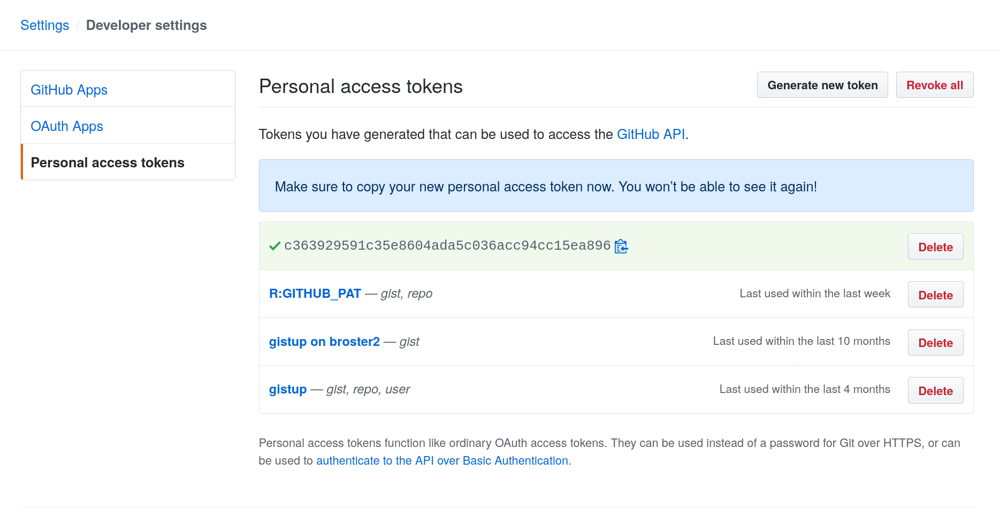
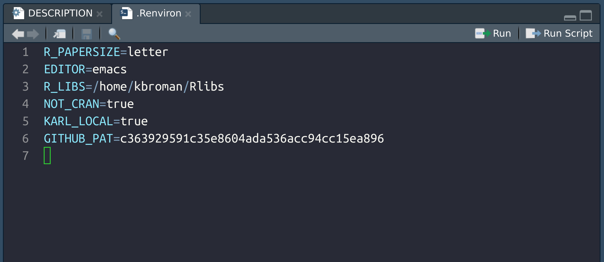

I will demonstrate the use of the
[usethis](https://usethis.r-lib.org/) and
[devtools](https://devtools.r-lib.org/) packages to create an R
package. I'll be doing this in [RStudio
desktop](https://rstudio.com/products/rstudio/download/#download).


### Start with some functions

I think it's best to start with some functions that we want to put
in the R package. We will use a pair of functions: one for simulating
Brownian motion, and the second for plotting the results.

```r
simBrM <-
function(n, sigma=1)
{
    stopifnot(n>=2, sigma>0)

    x <- matrix(rnorm(n*2, 0, sigma), ncol=2)
    colnames(x) <- c("x", "y")

    apply(x, 2, cumsum)
}

plotBrM <-
function(x, pointcolor=c("slateblue", "violetred"), ...)
{
    stopifnot(is.matrix(x), ncol(x)>=2, nrow(x)>=2)

    if(is.null(colnames(x))) colnames(x) <- c("x", "y")

    plot(x[,1], x[,2], xlab=colnames(x)[1], ylab=colnames(x)[2],
         type="l", las=1, ...)

    if(!is.null(pointcolor)) {
        points(x[c(1,nrow(x)), 1], x[c(1,nrow(x)), 2],
               pch=21, bg=pointcolor)
    }
}
```

Our goal is to make a package containing these functions.


### Create package skeleton

We first use `usethis::create_package()` to create a directory for
the package plus the skeleton of the files that are needed.
I'm going to place it on my Desktop (because I'm just going to
delete it later). But generally I keep my R packages in `~/Code/`.

```r
library(usethis)
create_package("~/Desktop/simBrM")
```

This will create a directory to contain the package, create some of
the basic files and subdirectories that are needed, including to
make the package directory an [RStudio
Project](https://r4ds.had.co.nz/workflow-projects.html), and then
open up another copy of RStudio with that project open.


### Make it a git repository

Next I'll make it a git repository.

```r
use_git()
```

It will ask me a couple of questions about making an initial
commit and will restart RStudio.

I'll next edit the `DESCRIPTION` file. I'll click on it in the
Files pane and will edit the `Title`, `Authors@R`, and
`Description` fields.

The title is supposed to be in "title case" (all words capitalized),
and the description is supposed to be one or more complete
sentences (start with capital letter and end with period).

I'll then click the Git pane in RStudio and stage and commit the
change.


### Put it on GitHub

I'll next connect to GitHub and will push my repository there.

```r
use_github()
```

If you've not connected to GitHub before, this will give an error,
and you need to set up a "personal token" in order to do things
like create github repositories from R. So you'll first do:

```r
browse_github_token()
```

This will open up a browser, ask you to log in to your github
account, and will open a form to create a github personal token:


Agree to the form and it will create a token like the following,
which you'll want to copy but not share with anyone. (The one shown
here is not my actual token; I deleted this one.)



Finally, go back to RStudio and edit (or create) your `~.Renviron`
file.

```r
edit_r_environ()
```

You'll want to add a line with `GITHUB_PAT=[your token]`, as in the
following.



You might need to restart R (in RStudio, click Session &rarr;
Restart R).

Then you can try again to make the connection to GitHub:

```r
use_github()
```


### Try it out

Let's try installing the package.

```r
install()
```

We can also check that the package conforms to R's requirements.

```r
check()
```


### Add a license

We got a warning about a non-standard license, so let's go ahead and
add a license.  I generally choose between the [MIT]() and [GPL-3]().
(MIT if I can, GPL-3 if I need to.) We'll talk more about this at the
end of the course.

```r
use_mit_license("Karl Broman")
```

This will add a couple of `LICENSE` files and edit the `DESCRIPTION`
file. Commit the changes and push them to GitHub.

Now if we run `check()`, it is clean.


### Add the functions

But wait, our package doesn't actually contain any code! Let's add our
R functions by pasting them into an R file, in the `R/` subdirectory.

```r
use_r("simBrM")
```

Paste in the code from the top of this page.

Now if you run `check()` again, it'll give a warning about
undocumented code and a note about not importing the functions
`plot()`, `points()`, and `rnorm()`.

But if we run `install()` it will still install our package, which we
can load with `library(simBrM)`. This will make `simBrM()` and
`plotBrM()` available to us. Note that we could also use `load_all()`
to do a quicker, temporary install-and-load, for development purposes.


### Add documentation

So let's add some documentation.

First, let's set things up to use Roxygen2 with markdown.

```r
use_roxygen_md()
```

Now we'll open up the `R/simBrM.R` file and start writing the documentation.
Put the cursor inside the first function, `simBrM()`. We can get a
skeleton of Roxygen2 documentation through the menu bar: Code &rarr;
Insert Roxygen Skeleton.

The key things are: a title; maybe also a description. Then
descriptions of each parameter and of the returned object. Finally,
add some examples.

For each function, we'll also want to add some `@importFrom`
directives, of functions that we use. This will lead to changes in the

```r
#' @importFrom stats rnorm
```


We then process the documentation:

```r
document()
```

We should also add `Imports: stats, graphics` to the `DESCRIPTION`
file.

```r
use_package("stats")
use_package("graphics")
```

It says we should refer to the functions with `stats::` and
`graphics::`, so maybe we should go back and edit those things.

But then finally, let's check the package with `check()` and install
it with `install()`.

Then stage, commit, and push.


### Add a ReadMe

It's always a good idea to include a ReadMe file, particularly for
packages on GitHub, as it's the ReadMe file that serves as sort of the
home page for the software.

The key things to include in the ReadMe are the purpose, how to
install, and a bit about usage.

To create a Markdown-based ReadMe file, do the following:

```r
use_readme_md()
```

This creates a `README.md` file and then opens it for editing.

Many people are making R Markdown based ReadMe files for their R
packages, with working R code and graphs and such. If you want to do
that, look at `use_readme_rmd()`.


### Add a vignette

The three main things people look at are the ReadMe file, the examples
in the help file, and tutorials. And in my experience, tutorials are
the most popular.

In the context of R packages, tutorials are called "vignettes". You
can create one in R Markdown using the following:

```r
use_vignette("simBrM", "Simulate Brownian motion")
```

Run `check()` and `install()` to make sure that there are no errors.

To install the vignette with the package, you need to do:

```r
install(build_vignettes=TRUE)
```

You should then be able to see the vignette listed when you do the
following:

```r
vignette(package="simBrM")
```

And you can open the vignette with the following:

```r
vignette("simBrM")
```

I recommend creating an introductory vignette that has the same name
as the package. But you can include as many vignettes as you would
like. Users really appreciate having many focused tutorials.
